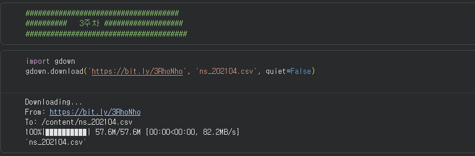
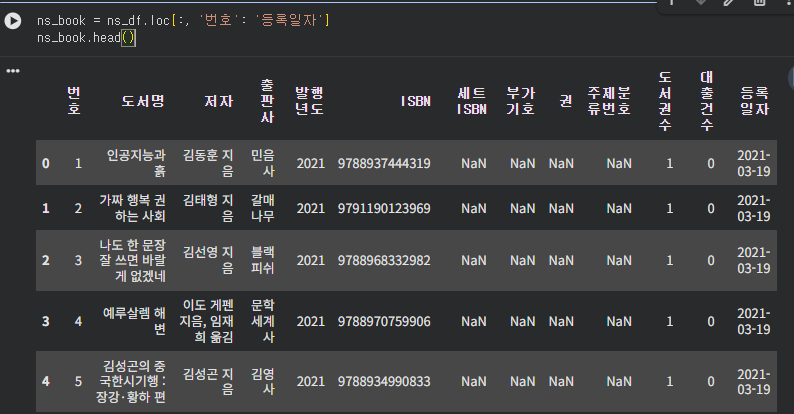
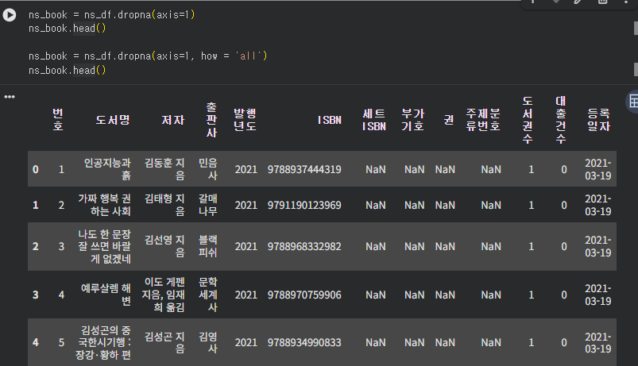
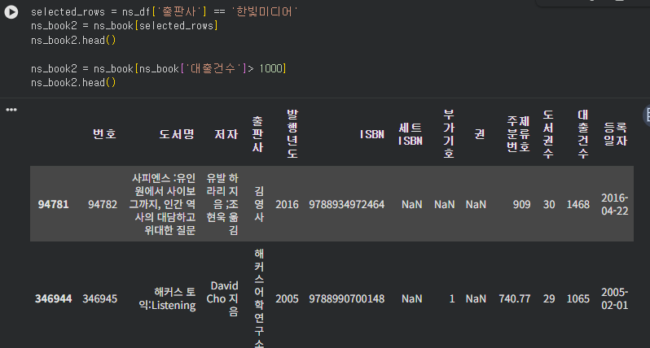
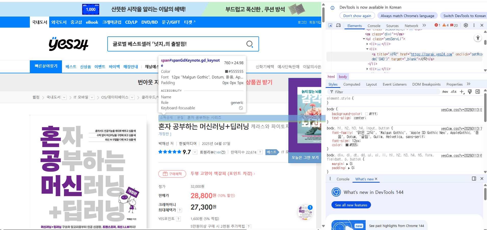
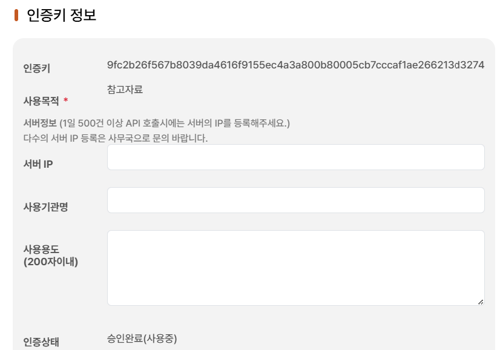

# 데이터분석 3주차 정규과제

📌데이터분석 정규과제는 매주 정해진 분량의 『*혼자 공부하는 데이터 분석 with 파이썬*』 을 읽고 학습하는 것입니다. 이번 주는 아래의 **DataAnalysis_3rd_TIL**에 나열된 분량을 읽고 공부하시면 됩니다.

아래의 문제를 풀어보며 학습 내용을 점검하세요. 문제를 해결하는 과정에서 개념을 스스로 정리하고, 필요한 경우 제시된 강의를 참고하여 보완하는 것이 좋습니다.

<!-- 강의 링크는 아래와 같습니다.
https://www.youtube.com/watch?v=CE3_InvbmLY&list=PLVsNizTWUw7FGzSRCkQrPEEe-ljVXgS7k&index=6
https://www.youtube.com/watch?v=hhbzUEQWdTg&list=PLVsNizTWUw7FGzSRCkQrPEEe-ljVXgS7k&index=7
-->


## DataAnalysis_3rd_TIL

### 3장 데이터 정제하기
#### 01. 불필요한 데이터 삭제하기
#### 02. 잘못된 데이터 수정하기


## Study Schedule

| 주차  | 공부 범위     | 완료 여부 |
| ----- | ------------- | --------- |
| 1주차 | p.24~81    | ✅         |
| 2주차 | p.84~151   | ✅         |
| 3주차 | p.154~219  | ✅         |
| 4주차 | p.222~279 | 🍽️         |
| 5주차 | p.282~325 | 🍽️         |
| 6주차 | p.328~379 | 🍽️         |
| 7주차 | p.382~430 | 🍽️         |

<br>

<!-- 여기까진 그대로 둬 주세요-->


# 1️⃣ 개념 정리 

## 01. 불필요한 데이터 삭제하기

<!-- 새롭게 배운 내용을 자유롭게 정리해주세요.-->

### 데이터 정제
- 열 삭제하기
~~~
ns_book = ns_df.loc[:, '번호': '등록일자']
ns_book.head()


- loc 메서드와 불리언 배열

selected_columns = ns_df.columns != 'Unnamed: 13'
ns_book = ns_df.loc[:, selected_columns]
ns_book.head()


- drop 메서드

ns_book = ns_df.drop('Unnamed: 13' , axis=1)
ns_book.head()


- dropna 메서드

ns_book = ns_df.dropna(axis=1)
ns_book.head()

ns_book = ns_df.dropna(axis=1, how = 'all')
ns_book.head()
~~~

- 행 삭제하기
~~~
ns_book2 = ns_book.drop([0,1])
ns_book2.head()


- [] 연산자와 불리언 배열


selected_rows = ns_df['출판사'] == '한빛미디어'
ns_book2 = ns_book[selected_rows]
ns_book2.head()

ns_book2 = ns_book[ns_book['대출건수']> 1000]
ns_book2.head()


- 중복된 행 찾기


dup_rows = ns_book.duplicated(subset = ['도서명', '저자', 'ISBN'],keep=False)
ns_book3 = ns_book[dup_rows]
ns_book3.head()


- 그룹별로 모으기


loan_count = count_df.groupby(by=['도서명', '저자', 'ISBN', '권'], dropna = False).sum()
loan_count.head()
~~~

## 02. 잘못된 데이터 수정하기

<!-- 새롭게 배운 내용을 자유롭게 정리해주세요.-->

### 데이터 탐색

- info 메서드 - 행과 열 개수, 데이터 타입, 비어있지 않은 행 개수, 사용하는 총 데이터 타입, 메모리 사용량 등

- isna 메서드 - ns_book.isna().sum() - 결측치 확인용

- NaN - 파이썬의 결측값 표현 방법

~~~
ns_book4.loc[0, '도서권수'] = None
ns_book4['도서권수'].isna().sum()

import numpy as np
ns_book4.loc[0, '부가기호'] = np.nan
~~~

### 데이터 수정

- fillna() 메서드 - 결측치 처리

~~~
그냥 처리 : df.fillna('없음')

한 컬럼만 처리 : df['컬럼'].fillna('없음')
df({'컬럼' : '없음'})
~~~

- replace() 메서드

~~~
df.replace(np.nan, '없음')
df.replace([np.nan, '2021'], ['없음','21'])


- 정규 표현식 : \d

df.replace({'컬럼' : {r'\d{2}(\d{2})' :r'\1'}}, regex=True)[100:102]

- 정규 표현식 : .
~~~

- contains() 메서드
~~~
num = df['컬럼'].str.contains('\D', na=True)

books = book.replace({'컬럼' : '.*(\d{4}).*}, r'\1', regex=True)
~~~
# 2️⃣ 수행 인증

<!-- 교재에서 안내된 과정을 직접 실행해본 뒤, 진행 결과가 보이도록 4~6장의 스크린샷을 캡처하여 아래에 첨부해주세요.-->
<!-- 이번 주차에는 API를 발급받는 과정도 포함하여 첨부해주세요.-->








<br>
<br>

# 3️⃣ 확인 문제

## 문제 1.

> **🧚Q. 다음 두 데이터프레임 df1, df2를 합쳐서 데이터프레임 df3를 만들려고 합니다.**  
> 적절한 판다스 명령을 선택해주세요.

<table>
<tr>

<td>

### df1

| index | col1 | col2 |
|-------|------|------|
| 0     | x    | 5    |
| 1     | y    | 6    |
| 2     | z    | 7    |

</td>

<td>

### df2

| index | col3 | col4 |
|-------|------|------|
| 0     | x    | 50   |
| 1     | y    | 60   |
| 2     | w    | 70   |

</td>

<td align="center" valign="middle">

<h2> ➜ </h2>

</td>

<td>

### df3 (결과)

| index | col1 | col2 | col3 | col4 |
|-------|------|------|------|------|
| 0     | x    | 5.0  | x    | 50.0 |
| 1     | y    | 6.0  | y    | 60.0 |
| 2     | z    | 7.0  | NaN  | NaN  |
| 3     | NaN  | NaN  | w    | 70.0 |

</td>

</tr>
</table>

```
1️⃣ pd.merge(df1, df2)
2️⃣ pd.merge(df1, df2, how='left')
3️⃣ pd.merge(df1, df2, left_on='col1', right_on='col3', how='outer')
4️⃣ pd.merge(df1, df2, left_on='col1', right_on='col3', how='inner')
```

```
정답은 3.
df3을 보면 df1에서는 col1, df2에서는 col3에 알파벳이 들어가 있어서 컬럼을 사용하고 싶지만 컬럼 이름이 달라서 그냥 사용할 수 없음.
따라서 이름 지정을 해주고, 한 쪽에만 데이터가 있어도 모두 사용하는 outer join 방식을 사용하였음.
```


### 🎉 수고하셨습니다.
