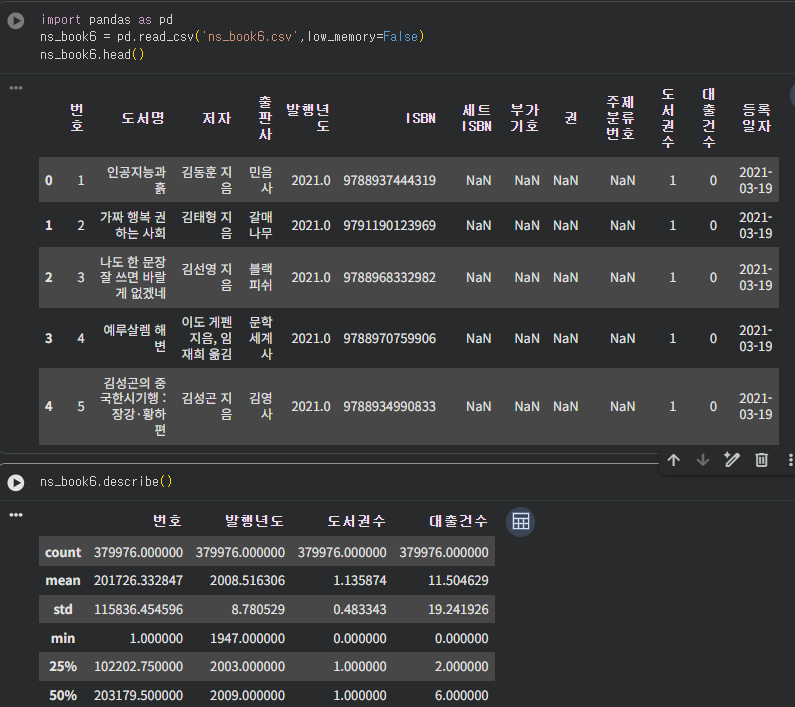
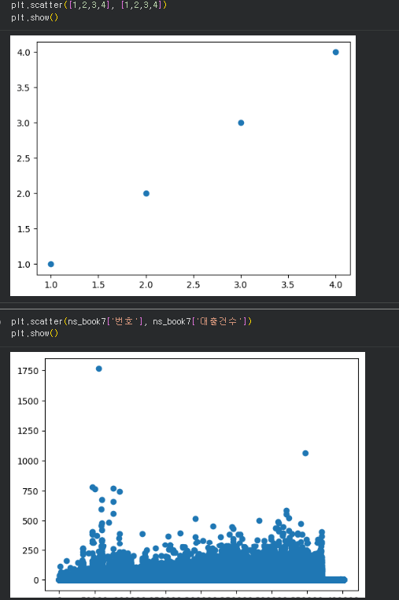
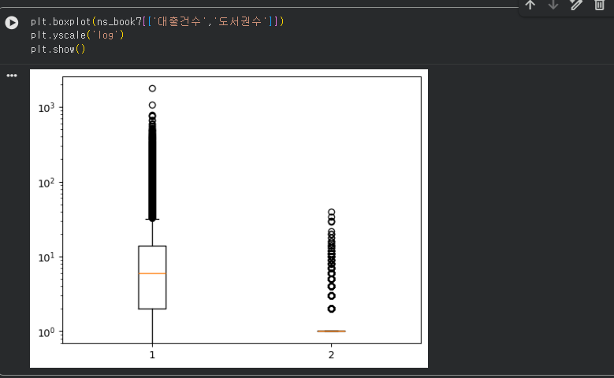

# 데이터분석 4주차 정규과제

📌데이터분석 정규과제는 매주 정해진 분량의 『*혼자 공부하는 데이터 분석 with 파이썬*』 을 읽고 학습하는 것입니다. 이번 주는 아래의 **DataAnalysis_4th_TIL**에 나열된 분량을 읽고 공부하시면 됩니다.

아래의 문제를 풀어보며 학습 내용을 점검하세요. 문제를 해결하는 과정에서 개념을 스스로 정리하고, 필요한 경우 제시된 강의를 참고하여 보완하는 것이 좋습니다.

<!-- 강의 링크는 아래와 같습니다.
https://www.youtube.com/watch?v=HNlRYQnLkek&list=PLVsNizTWUw7FGzSRCkQrPEEe-ljVXgS7k&index=8
https://www.youtube.com/watch?v=Cbk_tQtuhbM&list=PLVsNizTWUw7FGzSRCkQrPEEe-ljVXgS7k&index=9
-->


## DataAnalysis_4th_TIL

### 4장 데이터 요약하기
#### 01. 통계로 요약하기
#### 02. 분포 요약하기


## Study Schedule

| 주차  | 공부 범위     | 완료 여부 |
| ----- | ------------- | --------- |
| 1주차 | p.24~81    | ✅         |
| 2주차 | p.84~151   | ✅         |
| 3주차 | p.154~219  | ✅         |
| 4주차 | p.222~279 | ✅         |
| 5주차 | p.282~325 | 🍽️         |
| 6주차 | p.328~379 | 🍽️         |
| 7주차 | p.382~430 | 🍽️         |

<br>

<!-- 여기까진 그대로 둬 주세요-->


# 1️⃣ 개념 정리 

## 01. 통계로 요약하기

<!-- 새롭게 배운 내용을 자유롭게 정리해주세요.-->

### 1.1 요약 통계량 확인 (describe)
- **`df.describe()`**: 기본적으로 수치형 열의 기술통계를 요약한다. (count, mean, std, min, 25%, 50%, 75%, max)
- **`df.describe(include='object')`**: 문자열(객체) 타입 열의 요약 정보를 확인한다. (unique, top, freq 포함)

### 1.2 대표값: 평균과 중앙값
- **평균 (Mean)**: 모든 값을 더해 개수로 나눈 값. `df['열이름'].mean()`
- **중앙값 (Median)**: 데이터를 크기 순으로 나열했을 때 한가운데 위치한 값. `df['열이름'].median()`
  - 데이터에 아주 크거나 작은 '이상치'가 있을 때 평균보다 데이터의 특성을 더 잘 나타낸다.
- **최빈값 (Mode)**: 가장 빈번하게 등장하는 값. `df['열이름'].mode()`

### 1.3 데이터의 흩어짐: 분산과 표준편차
- **분산 (Variance)**: 데이터가 평균에서 얼마나 떨어져 있는지(편차)를 제곱하여 평균한 값. `df['열이름'].var()`
- **표준편차 (Standard Deviation)**: 분산의 제곱근. 원래 데이터와 단위가 같아 해석이 쉽다. `df['열이름'].std()`

### 1.4 분위수 (Quantile)
- 데이터를 4등분한 지점을 **4분위수**라고 한다. (25%, 50%, 75%)
- `df['열이름'].quantile([0.25, 0.5, 0.75])` 로 특정 위치의 값을 확인 가능하다.

## 02. 분포 요약하기

<!-- 새롭게 배운 내용을 자유롭게 정리해주세요.-->

숫자만으로는 알 수 없는 데이터의 '모양(분포)'을 그래프로 확인한다. `matplotlib.pyplot`을 주로 사용한다.

### 2.1 산점도 (Scatter Plot)
두 변수 간의 관계를 점으로 나타낸다.
```
import matplotlib.pyplot as plt

plt.scatter(df['x축_열'], df['y축_열'], alpha=0.1) 
# alpha는 투명도 (데이터 겹침 확인용)
plt.show()
```

### 2.2 히스토그램 (Histogram)
데이터를 일정한 구간(Bin)으로 나누고, 각 구간에 속한 데이터의 개수(도수)를 막대 높이로 나타낸다.

- **작성 코드**
```
import matplotlib.pyplot as plt

plt.hist(df['열이름'], bins=50) # bins는 구간의 개수
plt.yscale('log') # 데이터 편차가 클 때 로그 스케일 적용 가능
plt.show()
```

### 2.3 상자 수염 그래프 (Box Plot)
4분위수를 시각화하여 데이터의 분포와 이상치를 한눈에 파악하기 좋다.

구성: 최솟값, 1사분위수(Q1), 중앙값(Q2), 3사분위수(Q3), 최댓값

이상치(Outlier): 상자 길의 1.5배(IQR * 1.5)를 벗어난 데이터는 보통 점으로 표시된다.

```
plt.boxplot(df[['열1', '열2']])
plt.show()
```


# 2️⃣ 수행 인증

<!-- 교재에서 안내된 과정을 직접 실행해본 뒤, 진행 결과가 보이도록 3장 이상의 스크린샷을 캡처하여 아래에 첨부해주세요.-->




<br>
<br>

# 3️⃣ 확인 문제

## 문제 1.

> **🧚Q. 이번 주차에는 확인문제 대신 실습 과제를 진행합니다. 캐글에서 원하는 데이터셋을 선택하여 기술통계를 계산하고, 다양한 시각화를 수행해보세요.
작업은 코랩에서 진행한 뒤, 코랩 링크를 아래에 첨부해주세요.**

```
여기에 코랩 링크를 첨부해주세요!
(제출 전, 코랩의 공유 설정을 ‘링크가 있는 모든 사용자가 보기 가능’으로 변경했는지 반드시 확인해주세요.)
```
https://colab.research.google.com/drive/1-RTgd5IrERQQe8qKNvh-Lji36-sQIU72?usp=sharing


### 🎉 수고하셨습니다.
