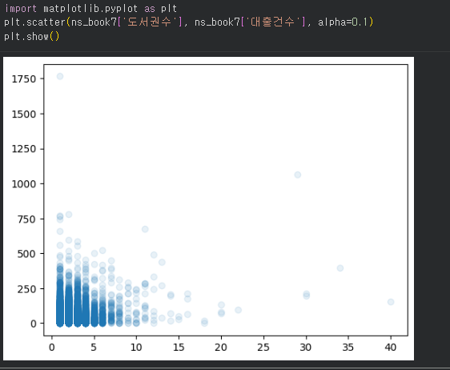
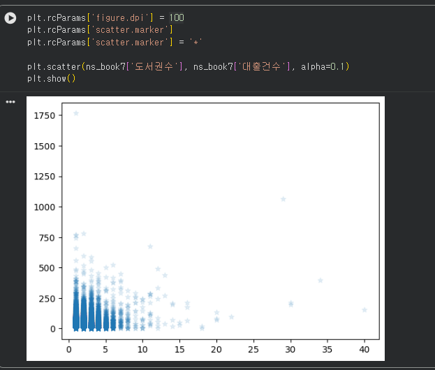
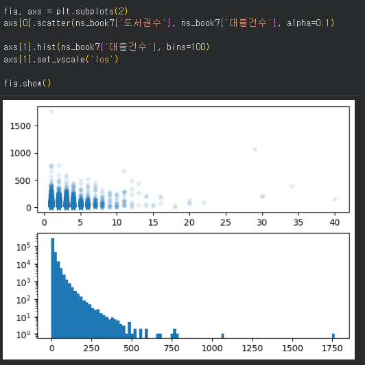
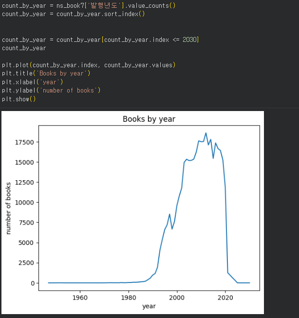
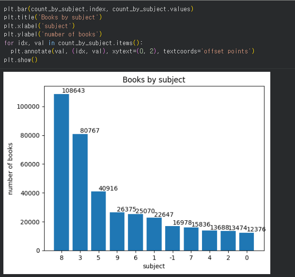

# 데이터분석 5주차 정규과제

📌데이터분석 정규과제는 매주 정해진 분량의 『*혼자 공부하는 데이터 분석 with 파이썬*』 을 읽고 학습하는 것입니다. 이번 주는 아래의 **DataAnalysis_5th_TIL**에 나열된 분량을 읽고 공부하시면 됩니다.

아래의 문제를 풀어보며 학습 내용을 점검하세요. 문제를 해결하는 과정에서 개념을 스스로 정리하고, 필요한 경우 제시된 강의를 참고하여 보완하는 것이 좋습니다.

<!-- 강의 링크는 아래와 같습니다.
https://www.youtube.com/watch?v=ho0LZ6GWhtc&list=PLVsNizTWUw7FGzSRCkQrPEEe-ljVXgS7k&index=10
https://www.youtube.com/watch?v=deYY4xHsI0o&list=PLVsNizTWUw7FGzSRCkQrPEEe-ljVXgS7k&index=11
-->


## DataAnalysis_5th_TIL

### 5장 데이터 시각화하기
#### 01. 맷플롯립 기본 요소 알아보기
#### 02. 선 그래프와 막대 그래프 그리기


## Study Schedule

| 주차  | 공부 범위     | 완료 여부 |
| ----- | ------------- | --------- |
| 1주차 | p.24~81    | ✅         |
| 2주차 | p.84~151   | ✅         |
| 3주차 | p.154~219  | ✅         |
| 4주차 | p.222~279 | ✅         |
| 5주차 | p.282~325 | ✅         |
| 6주차 | p.328~379 | 🍽️         |
| 7주차 | p.382~430 | 🍽️         |

<br>

<!-- 여기까진 그대로 둬 주세요-->


# 1️⃣ 개념 정리 

## 01. 맷플롯립 기본 요소 알아보기

<!-- 새롭게 배운 내용을 자유롭게 정리해주세요.-->

맷플롯립(Matplotlib)은 파이썬의 대표적인 시각화 라이브러리이다. 그래프의 각 요소를 세밀하게 제어하는 방법을 익힌다.

### 1. Figure와 rcParams

- Figure 객체: 모든 그래프 구성 요소를 담고 있는 최상위 컨테이너이다. `plt.figure()`로 명시적 생성이 가능하다.

- DPI (Dots Per Inch): 인치당 픽셀 수를 의미하며, 그래프의 해상도를 결정한다. 기본값은 보통 72이다.

- rcParams: 맷플롯립의 기본 설정값(글꼴, 크기, 색상 등)을 담고 있는 딕셔너리 형태의 객체이다.

```python
import matplotlib.pyplot as plt

# 그래프 기본 크기 확인 및 변경 (단위: 인치)
print(plt.rcParams['figure.figsize']) # 기본값 확인 [6.0, 4.0]
plt.rcParams['figure.figsize'] = (9, 6) # 너비 9, 높이 6으로 변경

plt.rcParams['figure.dpi'] = 100 # DPI 변경을 통한 해상도 조절
```

### 2. 서브플롯 (Subplots)

하나의 Figure 안에 여러 개의 그래프(Axes)를 배치할 때 사용한다.

```python

fig, axs = plt.subplots(1, 2, figsize=(10, 5)) # 1행 2열의 서브플롯 생성

axs[0].scatter([1, 2, 3], [4, 5, 6]) # 첫 번째 서브플롯 (index 0)
axs[0].set_title('Scatter Plot')

axs[1].hist([1, 1, 2, 3, 3, 3], bins=3) # 두 번째 서브플롯 (index 1)
axs[1].set_title('Histogram')

plt.show()
```

## 02. 선 그래프와 막대 그래프 그리기

<!-- 새롭게 배운 내용을 자유롭게 정리해주세요.-->

데이터의 추세나 항목 간 비교를 위해 가장 많이 사용하는 그래프 형태이다.

### 1. 선 그래프 (Line Plot)

: 데이터 포인트 사이를 선으로 이어 시간의 흐름에 따른 변화(추세)를 보기에 적합하다.

```python

plt.plot(count_by_year.index, count_by_year.values, 
         marker='o', linestyle='--', color='r', label='Loans')

plt.title('Books Loan Count by Year')
plt.xlabel('Year')
plt.ylabel('Loan Count')
plt.legend() 
plt.show()
```

### 2. 막대 그래프 (Bar Chart)

: 범주형 데이터의 크기를 비교할 때 사용한다. 수평 막대 그래프는 barh()를 사용한다.

```python

plt.bar(count_by_subject.index, count_by_subject.values, width=0.7, color='skyblue')

for i, v in enumerate(count_by_subject.values):
    plt.annotate(str(v), (i, v), xytext=(0, 2), 
                 textcoords='offset points', ha='center', fontsize=8)

plt.title('Books by Subject')
plt.xlabel('Subject')
plt.ylabel('Count')
plt.show()
```


# 2️⃣ 수행 인증

<!-- 교재에서 안내된 과정을 직접 실행해본 뒤, 진행 결과가 보이도록 4~6장의 스크린샷을 캡처하여 아래에 첨부해주세요.-->








<br>
<br>

# 3️⃣ 확인 문제

## 문제 1.

> **🧚Q. 다음 데이터를 이용하여 matplotlib으로 선그래프를 그리는 코드를 작성해주세요.**
- x = [1, 2, 3, 4, 5]
- y = [2, 4, 6, 8, 10]
> 조건은 아래와 같습니다.
```
1️⃣ 제목은 "Linear Trend"로 설정해주세요.
2️⃣ x축 이름은 "X values"로 설정해주세요.
3️⃣ y축 이름은 "Y values"로 설정해주세요.
4️⃣ 마커(marker)를 포함하여 선그래프를 그려주세요.
```

```python
import matplotlib.pyplot as plt

x = [1, 2, 3, 4, 5]
y = [2, 4, 6, 8, 10]

plt.plot(x, y, marker='o')
plt.title("Linear Trend")   
plt.xlabel("X values")      
plt.ylabel("Y values")    

plt.show()
```


### 🎉 수고하셨습니다.
