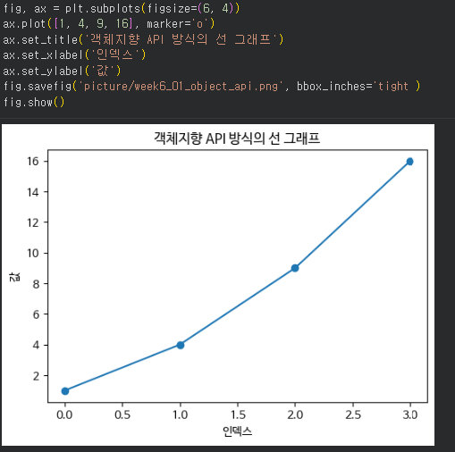
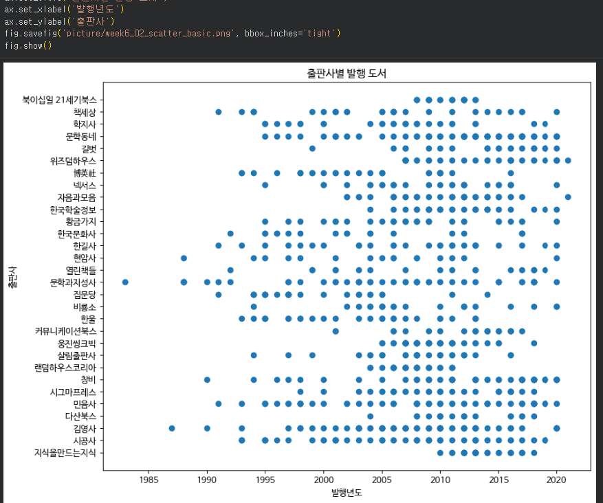
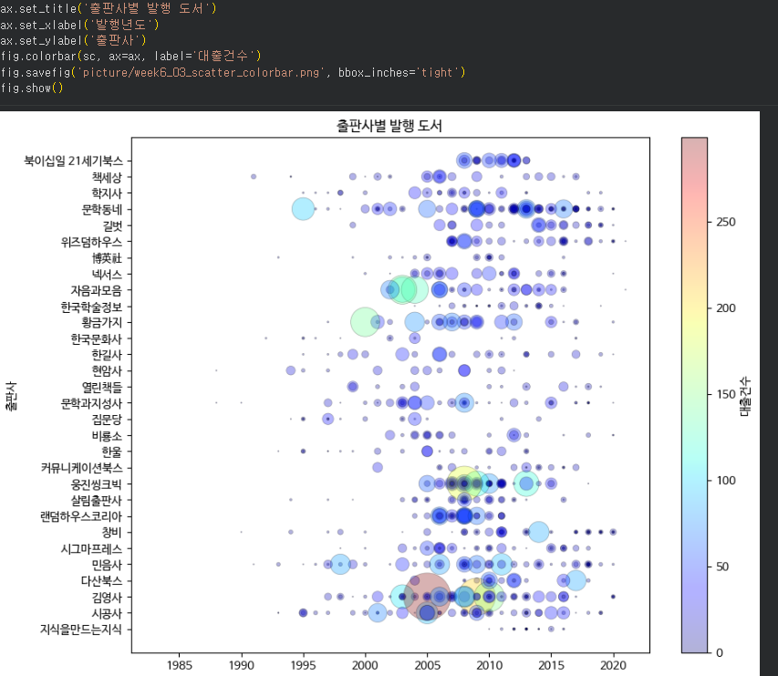
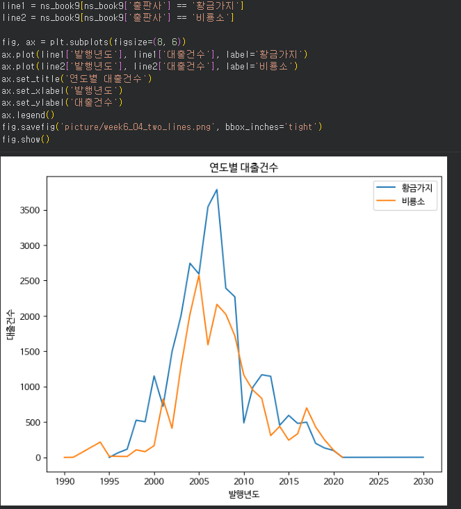
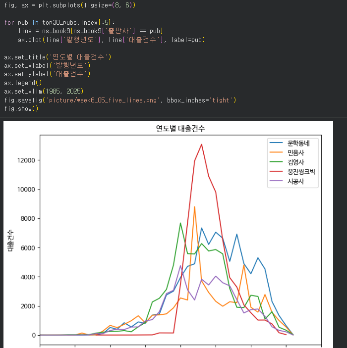

# 데이터분석 6주차 정규과제

📌데이터분석 정규과제는 매주 정해진 분량의 『*혼자 공부하는 데이터 분석 with 파이썬*』 을 읽고 학습하는 것입니다. 이번 주는 아래의 **DataAnalysis_6th_TIL**에 나열된 분량을 읽고 공부하시면 됩니다.

아래의 문제를 풀어보며 학습 내용을 점검하세요. 문제를 해결하는 과정에서 개념을 스스로 정리하고, 필요한 경우 제시된 강의를 참고하여 보완하는 것이 좋습니다.

<!-- 강의 링크는 아래와 같습니다.
https://www.youtube.com/watch?v=XD65UhBMOiI&list=PLVsNizTWUw7FGzSRCkQrPEEe-ljVXgS7k&index=12
https://www.youtube.com/watch?v=NTQ5NXelOfw&list=PLVsNizTWUw7FGzSRCkQrPEEe-ljVXgS7k&index=13
-->


## DataAnalysis_6th_TIL

### 6장 복잡한 데이터 표현하기
#### 01. 객체지향 API로 그래프 꾸미기
#### 02. 맷플롯립의 고급 기능 배우기


## Study Schedule

| 주차  | 공부 범위     | 완료 여부 |
| ----- | ------------- | --------- |
| 1주차 | p.24~81    | ✅         |
| 2주차 | p.84~151   | ✅         |
| 3주차 | p.154~219  | ✅         |
| 4주차 | p.222~279 | ✅         |
| 5주차 | p.282~325 | ✅         |
| 6주차 | p.328~379 | ✅         |
| 7주차 | p.382~430 | 🍽️         |

<br>

<!-- 여기까진 그대로 둬 주세요-->


# 1️⃣ 개념 정리 

## 01. 객체지향 API로 그래프 꾸미기

<!-- 새롭게 배운 내용을 자유롭게 정리해주세요.-->

복잡한 그래프를 표현할 때는 `pyplot` 방식보다 객체지향 API 방식을 사용하면 좋다.

### 1. pyplot 방식과 객체지향 API 방식

- pyplot 방식: `plt.plot()`, `plt.title()`처럼 `matplotlib.pyplot`의 함수를 바로 사용하는 방식이다.

- 객체지향 API 방식: Figure 객체와 Axes 객체를 직접 만든 뒤, 해당 객체의 메서드로 그래프를 그리는 방식이다.

```python
import matplotlib.pyplot as plt

plt.rcParams['figure.dpi'] = 100

fig, ax = plt.subplots()
ax.plot([1, 4, 9, 16])
ax.set_title('simple line graph')
fig.show()
```

하나의 그래프를 간단하게 그릴 때는 pyplot 방식도 괜찮지만, 여러 그래프를 한 화면에 배치하거나 그래프의 세부 요소를 조절할 때는 객체지향 API 방식이 더 편하다.

### 2. 그래프에 한글 출력하기

맷플롯립의 기본 폰트는 한글을 지원하지 않기 때문에 한글 제목이나 축 이름이 깨질 수 있다.

이때 `rc()` 함수로 폰트를 지정할 수 있다.

```python
plt.rc('font', family='NanumGothic')
plt.rcParams['axes.unicode_minus'] = False
```

- `font`: 그래프에 사용할 글꼴을 지정한다.
- `axes.unicode_minus`: 마이너스 기호가 깨지지 않도록 설정한다.

### 3. 산점도 그래프 꾸미기

산점도는 두 변수의 관계를 점으로 표현하는 그래프이다. 객체지향 API에서는 `ax.scatter()` 메서드를 사용한다.

```python
fig, ax = plt.subplots(figsize=(10, 8))

ax.scatter(ns_book8['발행년도'], ns_book8['출판사'],
           linewidths=0.5,
           edgecolors='k',
           alpha=0.3,
           s=ns_book8['대출건수'] * 2,
           c=ns_book8['대출건수'])

ax.set_title('출판사별 발행 도서')
fig.show()
```

- `s`: 마커의 크기를 지정한다. 값의 배열을 전달하면 데이터마다 마커 크기를 다르게 할 수 있다.
- `alpha`: 마커의 투명도를 지정한다.
- `edgecolors`: 마커 테두리 색을 지정한다.
- `linewidths`: 마커 테두리 선 두께를 지정한다.
- `c`: 마커 색에 사용할 값을 지정한다.

### 4. 컬러맵과 컬러 막대

컬러맵은 데이터 값에 따라 색을 다르게 표현하기 위해 사용하는 색상 목록이다.

맷플롯립의 기본 컬러맵은 `viridis`이고, `jet` 컬러맵도 자주 사용한다.

```python
fig, ax = plt.subplots(figsize=(10, 8))

sc = ax.scatter(ns_book8['발행년도'], ns_book8['출판사'],
                linewidths=0.5,
                edgecolors='k',
                alpha=0.3,
                s=ns_book8['대출건수'] * 2,
                c=ns_book8['대출건수'],
                cmap='jet')

ax.set_title('출판사별 발행 도서')
fig.colorbar(sc, ax=ax)
fig.show()
```

컬러 막대(colorbar)는 색이 어떤 값의 범위를 의미하는지 보여주는 막대이다. 보통 그래프 오른쪽에 표시하여 색과 실제 값을 함께 해석할 수 있게 한다.

## 02. 맷플롯립의 고급 기능 배우기

<!-- 새롭게 배운 내용을 자유롭게 정리해주세요.-->

맷플롯립에서는 하나의 피겨에 여러 개의 그래프를 그리거나, 스택 영역 그래프, 스택 막대 그래프, 원 그래프처럼 더 복잡한 시각화를 만들 수 있다.

### 1. 하나의 피겨에 여러 개의 선 그래프 그리기

여러 출판사의 연도별 대출건수를 비교할 때는 `plot()` 메서드를 여러 번 호출하면 된다.

```python
fig, ax = plt.subplots(figsize=(8, 6))

for pub in top30_pubs.index[:5]:
    line = ns_book9[ns_book9['출판사'] == pub]
    ax.plot(line['발행년도'], line['대출건수'], label=pub)

ax.set_title('연도별 대출건수')
ax.set_xlim(1985, 2025)
ax.legend()
fig.show()
```

- `label`: 각 선 그래프의 이름을 지정한다.
- `legend()`: 범례를 표시한다.
- `set_xlim()`: x축 범위를 지정한다.
- `set_ylim()`: y축 범위를 지정한다.

### 2. 피벗 테이블 만들기

스택 영역 그래프나 스택 막대 그래프를 그리려면 데이터를 그래프에 맞는 형태로 바꿔야 한다.

이때 `pivot_table()` 메서드를 사용하면 행과 열을 기준으로 데이터를 재구성할 수 있다.

```python
ns_book10 = ns_book9.pivot_table(index='출판사',
                                 columns='발행년도',
                                 values='대출건수')
```

`groupby()`는 기준이 되는 열을 행 인덱스로 묶는 방식이고, `pivot_table()`은 기준을 행과 열로 나누어 표 형태로 만드는 방식이다.

### 3. 스택 영역 그래프

스택 영역 그래프는 여러 선 그래프를 위로 쌓아 올린 형태이다. 전체 흐름과 각 항목의 비중을 함께 볼 수 있다.

```python
fig, ax = plt.subplots(figsize=(8, 6))

ax.stackplot(year_cols,
             ns_book10.loc[top10_pubs].fillna(0),
             labels=top10_pubs)

ax.set_title('연도별 대출건수')
ax.set_xlim(1985, 2025)
ax.legend(loc='upper left')
fig.show()
```

- `stackplot()`: 스택 영역 그래프를 그리는 메서드이다.
- `fillna(0)`: 결측값을 0으로 채워 그래프를 그릴 수 있게 한다.
- `loc`: 범례의 위치를 지정한다.

### 4. 여러 개의 막대 그래프와 스택 막대 그래프

막대 그래프를 여러 개 그릴 때는 `bar()`를 여러 번 호출한다. 막대를 나란히 비교하려면 x축 위치를 조금씩 이동시키고 막대 너비를 조절한다.

```python
fig, ax = plt.subplots(figsize=(8, 6))

line1 = ns_book9[ns_book9['출판사'] == '황금가지']
line2 = ns_book9[ns_book9['출판사'] == '비룡소']

ax.bar(line1['발행년도'] - 0.2, line1['대출건수'],
       width=0.4, label='황금가지')
ax.bar(line2['발행년도'] + 0.2, line2['대출건수'],
       width=0.4, label='비룡소')

ax.set_title('연도별 대출건수')
ax.legend()
fig.show()
```

스택 막대 그래프는 막대를 위로 쌓아 올리는 그래프이다. 맷플롯립에서는 `bottom` 매개변수를 사용하거나, 판다스의 `cumsum()`으로 값을 누적해서 그릴 수 있다.

```python
ns_book12 = ns_book10.loc[top10_pubs].fillna(0).cumsum()
```

판다스에서는 더 간단하게 `plot.bar(stacked=True)`를 사용할 수 있다.

```python
ns_book11.loc[1985:2025, top10_pubs].plot.bar(stacked=True, width=0.8)
```

### 5. 원 그래프

원 그래프는 전체에서 각 항목이 차지하는 비율을 부채꼴로 표현하는 그래프이다.

```python
data = top30_pubs[:10]
labels = top30_pubs.index[:10]

plt.pie(data,
        labels=labels,
        startangle=90,
        autopct='%.1f%%',
        explode=[0.1] + [0] * 9)

plt.title('출판사별 도서 비율')
plt.show()
```

- `labels`: 각 부채꼴의 이름을 지정한다.
- `startangle`: 원 그래프가 시작되는 각도를 지정한다.
- `autopct`: 비율을 표시하는 포맷 문자열을 지정한다.
- `explode`: 특정 부채꼴을 중심에서 떨어뜨려 강조한다.

### 6. 여러 종류의 그래프가 있는 서브플롯

`plt.subplots(2, 2)`처럼 행과 열 개수를 지정하면 여러 개의 서브플롯을 만들 수 있다.

```python
fig, axes = plt.subplots(2, 2, figsize=(20, 16))

axes[0, 0].scatter(ns_book8['발행년도'], ns_book8['출판사'])
axes[0, 1].stackplot(year_cols, ns_book10.loc[top10_pubs].fillna(0))
axes[1, 0].bar(year_cols, ns_book10.loc[top10_pubs[0]].fillna(0))
axes[1, 1].pie(data, labels=labels, autopct='%.1f%%')

fig.show()
```

서브플롯을 사용하면 산점도, 스택 영역 그래프, 막대 그래프, 원 그래프처럼 서로 다른 그래프를 한 화면에 배치할 수 있다.

# 2️⃣ 수행 인증

<!-- 교재에서 안내된 과정을 직접 실행해본 뒤, 진행 결과가 보이도록 4~6장의 스크린샷을 캡처하여 아래에 첨부해주세요.-->







<br>
<br>

# 3️⃣ 확인 문제

## 문제 1.

> **🧚Q. 이번 주차에는 확인문제 대신 그래프 그리기 실습을 진행합니다.
4주차에서 사용했던 캐글 데이터셋을 활용하여, 다양한 요소를 포함한 복잡한 그래프를 직접 작성해주세요.**

```
여기에 코랩 링크를 첨부해주세요!
(제출 전, 코랩의 공유 설정을 ‘링크가 있는 모든 사용자가 보기 가능’으로 변경했는지 반드시 확인해주세요.)
```
https://colab.research.google.com/drive/1THE1aL-bPxyGEARJ44qHukK80dl4Ux-T?usp=sharing


### 🎉 수고하셨습니다.
